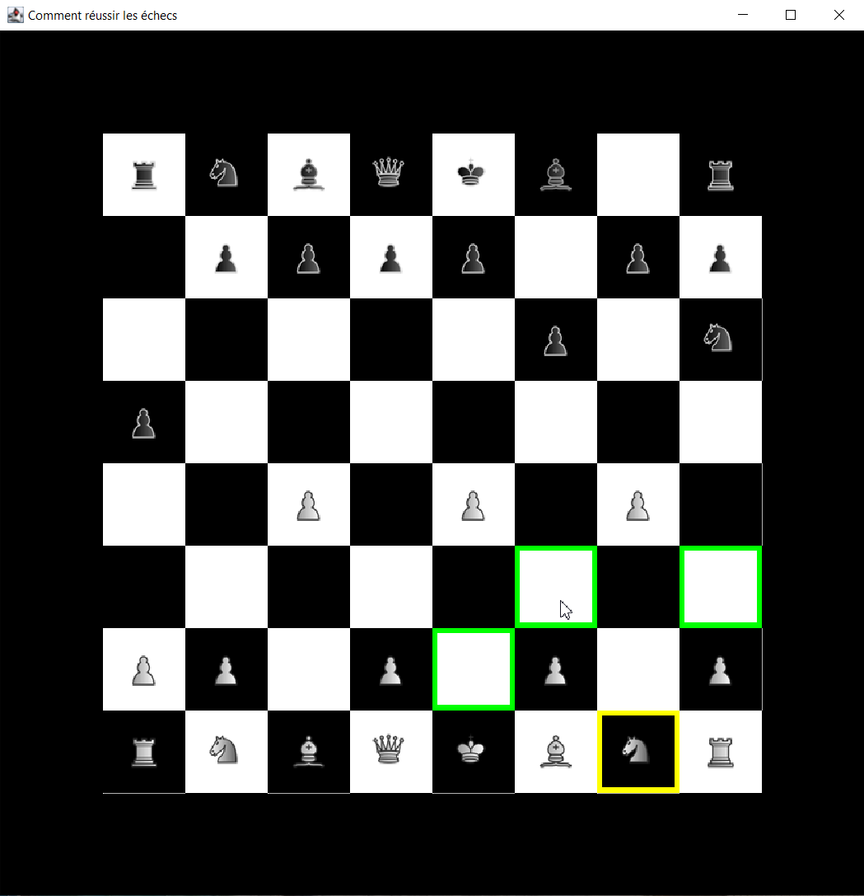

# Jeu d'Échecs

Ce projet de jeu d'échecs a été réalisé dans le cadre d'un projet scolaire. 

## Comment Jouer

1. Exécutez la classe `ChessDemo` pour lancer le jeu.

2. Utilisez la souris pour interagir avec le tableau d'échecs et effectuer des mouvements de pièces.

3. Jouez contre un ami ou un adversaire virtuel selon votre préférence.

## Remarques

Le projet a été entièrement commenté, vous pouvez générer la documentation javadoc si vous le souhaitez.

